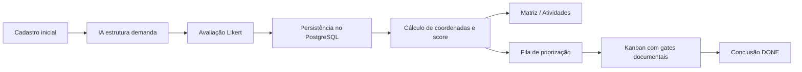

# Documentação Detalhada da Aplicação — Matriz de Severidade e Criticidade

**Versão do produto:** 1.0.0 (release 2026-04-02)  
**Stack:** FastAPI (API REST) + Dash (front monolítico em `app.py`) + PostgreSQL  
**Cliente HTTP do front:** `http://127.0.0.1:8000` (`services/api_client.py`)

---

## 1. Visão geral da aplicação

A aplicação **Matriz de Severidade e Criticidade** é um sistema de **priorização inteligente de requisitos de software**. Seu propósito é receber demandas brutas — problemas (bugs) ou melhorias (incrementos/features) —, estruturá-las com apoio de inteligência artificial, convertê-las em avaliações quantitativas por meio de escalas Likert, posicioná-las em matrizes bidimensionais, ordená-las em filas de priorização e conduzi-las por uma esteira Kanban governada por evidências documentais.

A arquitetura adota separação clara entre **apresentação** (Dash), **regras de negócio e orquestração** (camada `services/`) e **persistência** (repositórios em `db/` sobre PostgreSQL). O front é uma aplicação monolítica de página única (SPA): um único arquivo `app.py` concentra layouts, callbacks e roteamento; a API expõe contratos REST documentados em `/docs`.

### Entidades centrais no banco de dados

| Entidade | Papel |
|----------|-------|
| `projeto` | Agrupa demandas; possui versão semântica (`versao_atual`) e status operacional (`ativo`, `arquivado`, `descontinuado`). |
| `entrada_bruta` | Registra o texto original e metadados do cadastro inicial (módulo, contexto, perfil do solicitante, JSON auxiliar). |
| `requisito_estruturado` | Saída estruturada da IA: título, descrição refinada, tipo (`BUG` ou `INCREMENTO`), objetivo e finalidade. |
| `avaliacao_requisito` | Registra quem avaliou e quando. |
| `resposta_avaliacao` | Cada resposta Likert, com dimensão (`CRITICIDADE`, `SEVERIDADE`, `ESFORCO`, `VALOR`) e valor numérico 1–5. |
| `status_requisito` | Status atual da atividade na esteira (criada dinamicamente pelo repositório). |
| `requisito_doc_fase` | Documentação por fase do Kanban (JSON/texto por código de fase). |

### Navegação global (sidebar)

A barra lateral fixa concentra todos os links de navegação via `dcc.Link`:

| Item do menu | Rota | Função |
|--------------|------|--------|
| Cadastro | `/` | Entrada de demandas e avaliação Likert |
| Atividades priorizadas | `/atividades` | Matrizes, resumo e tabela |
| Esteira Kanban | `/kanban` | Esteira visual com 6 colunas |
| Lista da esteira | `/kanban-lista` | Visão tabular das mesmas atividades |
| Projetos | `/projetos` | Cadastro e governança de projetos |
| Fila | `/fila` | Filas ordenadas de bugs e incrementos |
| Calibragem | `/calibragem` | Vazão da fila e limites WIP |

Um botão hamburger (`btn-toggle-sidebar`) recolhe ou expande a sidebar; o estado persiste em `store-sidebar-open`.

---

## 2. Fluxo geral do sistema

O fluxo ponta a ponta pode ser compreendido como uma cadeia de transformações de informação:



**Etapa 1 — Coleta de contexto:** O usuário descreve a demanda em linguagem natural e preenche campos complementares. Esses dados ainda **não** constituem um requisito finalizado; servem como insumo para a IA.

**Etapa 2 — Estruturação com IA:** O front envia o contexto à API (`POST /api/v1/requisitos/analise`), que consulta o modelo Gemini via `services/analise_ia_service.py` e o prompt definido em `prompts.py`. A IA devolve título, descrição organizada, tipo, objetivo, finalidade e perguntas de avaliação.

**Etapa 3 — Avaliação humana:** O usuário responde perguntas em escala Likert (valores 1 a 5) e informa o responsável pela avaliação. Cada pergunta possui uma **dimensão** que determina o eixo da matriz.

**Etapa 4 — Persistência transacional:** Ao salvar (`POST /api/v1/requisitos/salvar-avaliacao`), o sistema grava entrada bruta, requisito estruturado, avaliação e respostas. O projeto vinculado recebe incremento automático de versão **patch**.

**Etapa 5 — Posicionamento na matriz:** O repositório calcula médias por dimensão e deriva `coordenada_x`, `coordenada_y`, `score` e `prioridade_categorica`.

**Etapa 6 — Fila:** Com base em quadrantes, distância ao canto ideal, envelhecimento e multiplicadores de fase, cada item recebe `score_final` e posição na fila.

**Etapa 7 — Kanban:** A atividade percorre colunas BACKLOG → TO DO → DEVELOP → TEST → DEPLOY → DONE. Avanços exigem documentação da fase atual e respeitam limites WIP configurados na Calibragem.

---

## 3. Tela de Priorização Inteligente de Requisitos

**Rota:** `/`  
**Layout:** `_layout_cadastro()`  
**Objetivo:** Ponto de entrada do sistema. Coleta dados iniciais da demanda, aciona a IA para estruturação e conduz a avaliação Likert que determina a posição na matriz.

**Papel no fluxo:** Esta tela inicia o ciclo de vida de toda demanda. Sem passar por ela (cadastro + IA + Likert + salvamento), não há registro persistido que alimente Atividades, Fila ou Kanban.

### Estrutura em três seções numeradas

A tela divide-se visualmente em três etapas progressivas, sinalizadas por badges numerados (1, 2, 3):

#### Seção 1 — Identificação da Demanda (`layout_secao1`)

Esta seção **não cadastra diretamente um requisito finalizado**. Ela existe para reunir o máximo de contexto qualitativo sobre a demanda antes da intervenção da IA. Quanto mais rico o contexto, melhor a IA consegue inferir tipo, redigir descrição e formular perguntas adequadas.

| Campo (ID) | Tipo | O que coleta | Por que importa |
|------------|------|--------------|-----------------|
| `texto_original` | Textarea | Descrição livre do problema ou melhoria | Núcleo semântico enviado à IA; vira `texto_original` persistido |
| `tipo_informado_usuario` | Dropdown | BUG, INCREMENTO ou NAO_SEI | Orienta a IA; se NAO_SEI, a IA infere pelo conteúdo |
| `modulo_afetado` | Input | Área do sistema (ex.: checkout) | Contextualiza escopo técnico |
| `contexto_negocio` | Textarea | Importância da área para o negócio | Ajuda a IA a calibrar criticidade/valor |
| `objetivo_desejado` | Textarea | Resultado esperado | Diferencia sintoma de necessidade real |
| `impacto_percebido_usuario` | Input | Impacto subjetivo | Sinal para severidade ou valor |
| `frequencia_ocorrencia` | Dropdown | nunca, raramente, às vezes, com frequência, sempre | Indica recorrência (relevante para bugs) |
| `urgencia_percebida` | Dropdown | baixa, média, alta, crítica | Pressão temporal percebida |
| `ha_contorno` | Textarea | Workaround existente | Reduz ou aumenta urgência conforme contorno |
| `sistema_ou_produto` | Input | Produto/sistema relacionado | Delimita unidade de software |
| `cadastro-id-projeto` | Dropdown | Projeto vinculado (obrigatório) | Toda demanda exige projeto; opções vêm de `GET /api/v1/projetos` |
| `perfil_solicitante` | Dropdown | usuario_final, analista, gestor, etc. | Peso interpretativo para a IA |
| `cadastro-perfil-solicitante-novo` + `btn-adicionar-perfil-solicitante` | Input + botão | Perfil customizado na sessão | Adiciona opção temporária em `store-perfil-solicitante-extra` |

**Botão «Analisar e estruturar com IA»** (`btn-analisar`):

- **Validações:** exige `texto_original` preenchido e projeto selecionado.
- **API consumida:** `POST /api/v1/requisitos/analise`
- **Payload enviado:** objeto com campos não vazios do formulário (texto, tipo, módulo, contexto, objetivo, impacto, frequência, urgência, contorno, sistema, perfil).
- **Resposta da API:** `AnaliseRequisitoResponse` com `titulo_requisito`, `descricao_requisito`, `tipo_requisito`, `objetivo`, `finalidade`, `perguntas_avaliacao[]`.
- **Efeito no front:** popula `store-analise`, renderiza Seção 2 e Seção 3, exibe mensagem de sucesso em `msg-analise`.

#### Seção 2 — Demanda estruturada pela IA (`secao2-container`)

Renderizada dinamicamente por `_render_secao2()` após análise bem-sucedida. **Somente leitura.**

Exibe:

- Badge de classificação (Bug ou Incremento) com cor distinta (`#dc2626` bugs, `#2563eb` incrementos).
- Título sugerido pela IA.
- Descrição refinada.
- Objetivo e finalidade.

Esta seção materializa a transformação de texto bruto em requisito estruturado. O usuário revisa semanticamente antes de avaliar; não há edição inline nesta versão.

#### Seção 3 — Avaliação da prioridade (`secao3-container`)

Renderizada por `_render_secao3()`. Aqui a informação qualitativa torna-se **quantitativa**.

| Componente | Função |
|------------|--------|
| `usuario_avaliador` | Nome de quem responde; obrigatório no salvamento |
| `{"type": "resposta", "index": i}` (RadioItems) | Uma escala Likert por pergunta; 5 opções com valores 1–5 |
| `btn-calcular` | «Salvar avaliação e posicionar na matriz» |
| `output-calculo` | Feedback de validação ou sucesso |
| `confirm-salvo` | Diálogo de confirmação após persistência |

**Lógica das perguntas Likert:**

Cada pergunta possui:

- `id_pergunta`: identificador sequencial
- `texto`: enunciado contextualizado
- `dimensao`: `CRITICIDADE`, `SEVERIDADE`, `ESFORCO` ou `VALOR`
- `opcoes_resposta[]`: exatamente 5 opções com `rotulo` e `valor` (1 a 5)

**Derivação das coordenadas:**

- **BUG:** média das respostas com dimensão `CRITICIDADE` → `coordenada_x`; média de `SEVERIDADE` → `coordenada_y`.
- **INCREMENTO:** média de `ESFORCO` → `coordenada_x`; média de `VALOR` → `coordenada_y`.

**Score:** `coordenada_x × coordenada_y` (arredondado a 2 casas).

**Prioridade categórica:**

| Score | Prioridade |
|-------|------------|
| ≥ 15 | ALTA |
| ≥ 8 | MEDIA |
| < 8 | BAIXA |

**Botão «Salvar avaliação e posicionar na matriz»:**

- **API:** `POST /api/v1/requisitos/salvar-avaliacao`
- **Payload:** título, tipo, textos da IA, `usuario_avaliador`, `perfil_avaliador`, array `respostas[]`, objeto `cadastro` (inclui `id_projeto` obrigatório).
- **Resposta:** `{ sucesso, id_entrada_bruta, id_requisito, id_avaliacao }`
- **Pós-salvamento:** evolução automática do projeto via `POST /api/v1/projetos/{id}/evoluir-versao` com nível `patch` e motivo «Demanda priorizada registrada na matriz».
- **Reset:** após confirmar o diálogo `confirm-salvo`, o formulário da Seção 1 é zerado e as seções 2 e 3 são limpas.

**Exemplo prático:** Um gestor descreve «botão de finalizar compra não responde no checkout», informa urgência alta e seleciona projeto «E-commerce v2.3». A IA classifica como BUG, gera perguntas de criticidade e severidade. Após Likert (criticidade 5, severidade 4), o item posiciona-se em (5, 4) com score 20 (ALTA) e entra nas telas de Atividades e Fila.

---

## 4. Tela de Atividades Priorizadas

**Rota:** `/atividades`  
**Layout:** header + `_layout_atividades_corpo()`  
**Objetivo:** Visualizar todas as demandas já avaliadas, filtrá-las e interpretá-las nas matrizes e na tabela operacional.

**Papel no fluxo:** Consolida o resultado numérico da avaliação. É a principal ferramenta de leitura gerencial da carteira de bugs e incrementos.

### Componentes

#### Filtros

| ID | Opções | Comportamento |
|----|--------|---------------|
| `ativ-filtro-tipo` | Todos, BUG, INCREMENTO | Filtra por tipo |
| `ativ-filtro-status` | Padrão (oculta concluídos), todos, BACKLOG, TO_DO, … | Por padrão exclui DONE/CONCLUIDO |
| `ativ-filtro-busca` | Texto livre (debounce) | Busca por trecho do título ou ID numérico |

#### Cards de resumo (`atividades-resumo`)

Quatro contadores sobre o conjunto **filtrado**:

- Bugs
- Incrementos
- Concluídas
- Pendentes

#### Dois gráficos Plotly

| ID | Título | Eixo X | Eixo Y | Cor |
|----|--------|--------|--------|-----|
| `atividades-grafico-bugs` | Matriz de BUGs | Criticidade | Severidade | Vermelho `#dc2626` |
| `atividades-grafico-incrementos` | Matriz de INCREMENTOs | Esforço | Valor | Azul `#2563eb` |

**API consumida ao abrir a rota:** `GET /api/v1/requisitos/atividades` → lista de `AtividadePriorizada`.

#### Tabela (`atividades-tabela`)

Colunas: ID, Título, Tipo, Projeto, Versão, X, Y, Score, Prioridade, Status, Detalhe (link `/atividade/{id}`).

**Callback principal:** `_render_atividades` — reage a `store-atividades` e aos três filtros.

**Comportamento esperado:** Ao navegar para `/atividades`, o router recarrega `store-atividades` da API. Filtros aplicam-se client-side sem nova chamada.

---

## 5. Tela da Fila de Priorização

**Rota:** `/fila`  
**Layout:** `_layout_fila()` → `fila-conteudo`  
**Objetivo:** Apresentar a ordenação algorítmica de bugs e incrementos conforme regras de quadrante, distância ao canto ideal e score final enriquecido.

**Papel no fluxo:** Traduz a posição na matriz em **sequência operacional** — o que deve ser puxado primeiro do backlog conceitual.

### Estrutura visual

Duas seções de tabela HTML:

1. **Fila de bugs**
2. **Fila de features/incrementos**

### Colunas das tabelas

Pos., ID, Título, Tipo, Prioridade, Status, Score final, Faixa, Dias parado, Detalhe (link).

### APIs consumidas

| Endpoint | Retorno |
|----------|---------|
| `GET /api/v1/fila/bugs` | Lista ordenada só de BUG |
| `GET /api/v1/fila/incrementos` | Lista ordenada só de INCREMENTO |

Alternativamente, o router pode usar formato legado com `payload.items`; a implementação atual prefere as duas rotas separadas via `api_obter_fila_duas()`.

### Campos enriquecidos por item (camada B)

Cada item na fila recebe, além das coordenadas:

| Campo | Significado |
|-------|-------------|
| `score_base` | `coordenada_x × coordenada_y` |
| `bonus_tempo` | Bônus por dias parado desde a avaliação |
| `bonus_quadrante` | Ajuste conforme quadrante na matriz |
| `bonus_fase` | Multiplicador conforme status Kanban |
| `bonus_manual` | Reservado (atualmente 0) |
| `score_final` | Soma usada como desempate |
| `faixa` | Baixa, Média, Alta ou Crítica |
| `dias_parado` | Dias desde `data_avaliacao` |
| `fila_ordem_quadrante` | 1 (mais prioritário) a 4 |
| `fila_distancia_ideal` | Distância euclidiana ao canto ideal |

**Comportamento esperado:** Sem filtros na UI; dados carregados ao entrar na rota. Fila vazia exibe mensagem explicativa; erro de API exibe mensagem em vermelho.

---

## 6. Tela da Esteira Kanban

**Rota:** `/kanban`  
**Layout:** `_layout_kanban()`  
**Objetivo:** Representar visualmente o fluxo operacional de cada demanda avaliada, com movimentação controlada por WIP e gates documentais.

**Papel no fluxo:** Após priorização, a demanda torna-se **cartão de trabalho** que percorre fases até conclusão.

### Colunas (baias)

`BACKLOG` → `TO DO` → `DEVELOP` → `TEST` → `DEPLOY` → `DONE`

Cada coluna possui container `kanban-col-{nome}`.

### Cartões

Cada cartão exibe:

- Título da demanda
- Tipo (BUG / INCREMENTO)
- Prioridade categórica
- Projeto e versão
- Aviso de gate documental pendente (se aplicável)
- Botões **← Voltar** e **Avançar →** (IDs pattern: `kanban-move-prev`, `kanban-move-next`)
- Link «Detalhe da atividade» → `/atividade/{id}`

**Importante:** Não há drag-and-drop. A movimentação é exclusivamente por botões.

### Mensagens (`kanban-msg`)

Canal central de feedback:

- Sucesso ao mover
- Erro de API
- Bloqueio por limite WIP
- Bloqueio documental com lista do que falta + link para detalhe

### Regras de movimentação

1. **Retrocesso:** permitido (qualquer número de colunas para trás).
2. **Avanço:** apenas **uma coluna por vez**.
3. **WIP:** ao entrar em TO DO, DEVELOP, TEST ou DEPLOY, verifica contagem vs. limite da Calibragem.
4. **Gate documental:** ao avançar, exige documentação completa da fase atual (ver seção 12).
5. **Persistência:** `POST /api/v1/requisitos/{id}/status` com `{ "status": "TO_DO" }` etc.

**APIs:**

- `GET /api/v1/requisitos/atividades` — popula `store-kanban`
- `GET /api/v1/requisitos/{id}/documentacao-fase` — popula `store-kanban-docs` por cartão
- `POST /api/v1/requisitos/{id}/status` — persiste movimento

**Mapeamento status API → coluna:** Status `AVALIADO` e `PRIORIZADO` mapeiam para coluna **TO DO** (demandas recém-avaliadas entram diretamente na fila de execução conceitual).

### Tela auxiliar: Lista da esteira (`/kanban-lista`)

Visão tabular das mesmas atividades: chips de contagem por fase + tabela com Fase Kanban, Status API, ID, Título, Tipo, Prioridade, Score, Projeto, Detalhe.

---

## 7. Tela de Detalhe da Atividade / Documentação por fase

**Rota:** `/atividade/<id>`  
**Layout:** `_layout_atividade_detalhe()` → conteúdo dinâmico em `atividade-detalhe-conteudo`  
**Objetivo:** Hub operacional e de governança de uma demanda específica — visão 360 parcial, documentação por fase, gates e auditoria.

**Papel no fluxo:** Concentra tudo que o Kanban exige como evidência. Sem preencher as abas aqui, o cartão não avança.

### Sete blocos numerados

#### Bloco 1 — Identificação da atividade

ID, título, descrição, tipo, status, fase Kanban mapeada, projeto, versão, módulo, solicitante, data de avaliação. Sub-bloco opcional de visão 360 (`identificacao`).

#### Bloco 2 — Origem da demanda

Texto original, contexto, objetivo, impacto, frequência, urgência, contorno, sistema, perfil. Campos completos dependem de endpoint de visão 360 (muitos não vêm em `GET /atividades`).

#### Bloco 3 — Estruturação da IA

Título, descrição estruturada, tipo, objetivo, finalidade.

#### Bloco 4 — Avaliação e plotagem

Coordenadas X/Y, eixos conforme tipo, score, prioridade categórica. Quadrante e score de fila aparecem como «—» (não expostos neste endpoint). Perguntas/respostas individuais aguardam visão 360.

#### Bloco 5 — Situação operacional

Fase atual, próxima coluna, checklist visual do gate documental da fase, botão «Atualizar documentação da API», JSON de gates (`GET /api/v1/kanban/{id}/gates`).

#### Bloco 6 — Documentação por fase (abas)

Seis abas correspondentes às transições do Kanban:

| Aba | Código | Transição |
|-----|--------|-----------|
| BACKLOG | `doc_requisito` | BACKLOG → TO DO |
| TO DO | `prontidao_dev` | TO DO → DEVELOP |
| DEVELOP | `entrega_dev` | DEVELOP → TEST |
| TEST | `casos_teste` | TEST → DEPLOY |
| DEPLOY | `deploy` | DEPLOY → DONE |
| DONE | `encerramento` | Resumo e encerramento |

Cada aba possui formulário específico, indicadores de gate em tempo real e botão «Guardar esta fase». Persistência via `PUT/POST /api/v1/requisitos/{id}/documentacao-fase/{fase_codigo}`.

**Formulário doc_requisito (BACKLOG):**

- Nome da funcionalidade
- Descrição detalhada
- Restrições
- Requisitos funcionais (RF) — lista dinâmica
- Requisitos não funcionais (RNF) — lista dinâmica
- Regras de negócio — lista dinâmica
- Critérios de aceitação — lista dinâmica

**Formulário prontidao_dev (TO DO):**

- Responsável pelo desenvolvimento
- Registrado por
- Data da prontidão
- Checklist: documento revisado, critérios existentes, escopo entendido, responsável definido

**Formulário entrega_dev (DEVELOP):**

- Nome da funcionalidade/correção
- O que foi desenvolvido
- O que foi alterado
- O que deve ser validado (QA)
- Branch e commit de referência
- Desenvolvedor responsável
- Data de entrega para teste

**Formulário casos_teste (TEST):**

Casos dinâmicos com: resumo, passos, resultado esperado, resultado obtido, executor, data, evidência, status (PENDENTE/APROVADO/REPROVADO). Gate exige **pelo menos um caso APROVADO** completo.

**Formulário deploy (DEPLOY):**

- Versão entregue
- Ambiente
- Data do deploy
- Responsável pelo deploy

**Formulário encerramento (DONE):**

Resumo consolidado BACKLOG→DEPLOY + textarea livre.

#### Bloco 7 — Auditoria

Tabela ou JSON de movimentações e tentativas bloqueadas via `GET /api/v1/demandas/{id}/auditoria` (endpoint **ainda não implementado** na API — front exibe mensagem amigável).

### APIs consumidas no detalhe

| Endpoint | Situação |
|----------|----------|
| `GET /api/v1/requisitos/atividades` | Snapshot da atividade |
| `GET /api/v1/requisitos/{id}/documentacao-fase` | Documentação por fase |
| `GET /api/v1/kanban/{id}/gates` | Gates calculados |
| `GET /api/v1/demandas/{id}/visao-360` | **Não implementado** |
| `GET /api/v1/demandas/{id}/auditoria` | **Não implementado** |

---

## 8. Tela de Calibragem da Fila

**Rota:** `/calibragem`  
**Layout:** `_layout_calibragem()`  
**Objetivo:** Ajustar parâmetros locais de vazão entre bugs e incrementos e limites WIP do Kanban.

**Papel no fluxo:** Calibra o equilíbrio operacional entre correções e melhorias, e impede sobrecarga de colunas executáveis.

### Componentes visíveis

**Distribuição da fila:**

| Campo | ID | Descrição |
|-------|-----|-----------|
| Percentual bugs | `calib-vazao-bugs` | 0–100; padrão 60 |
| Percentual incrementos | `calib-vazao-incrementos` | Calculado automaticamente (100 − bugs); readonly |

**Limites WIP por coluna:**

| Coluna | ID input | Botões ± | Padrão |
|--------|----------|----------|--------|
| TO DO | `calib-wip-todo` | `wip-todo-dec/inc` | 5 |
| DEVELOP | `calib-wip-develop` | `wip-develop-dec/inc` | 2 |
| TEST | `calib-wip-test` | `wip-test-dec/inc` | 2 |
| DEPLOY | `calib-wip-deploy` | `wip-deploy-dec/inc` | 1 |

**Botão «Salvar regras da fila»** (`btn-salvar-calibragem`): persiste em `config_fila.json` via callback `_calibragem_salvar`.

### Campos ocultos (sem UI)

`calib-env-intervalo` e `calib-env-limite` — parâmetros de **envelhecimento** da fila existem no modelo de configuração e são salvos, mas não possuem editor visual.

**Comportamento:** WIP é lido pelo Kanban via `get_config_fila()`. Vazão alimenta `montar_fila()` quando fila intercalada é usada (a tela `/fila` exibe duas filas separadas, não intercaladas).

---

## 9. Tela de Projetos

**Rota:** `/projetos`  
**Layout:** `_layout_projetos()`  
**Objetivo:** Cadastrar e governar projetos aos quais todas as demandas devem estar vinculadas.

**Papel no fluxo:** Projeto é pré-requisito do cadastro. Versão do projeto evolui automaticamente (patch) a cada demanda salva na matriz.

### Bloco de cadastro

| Campo | ID | Descrição |
|-------|-----|-----------|
| Tipo de origem | `proj-tipo-origem` | `novo` (inicia 1.0.0) ou `existente` |
| Versão existente | `proj-versao-existente` | Obrigatório se origem = existente |
| Nome | `proj-nome` | Único (case-insensitive) |
| Descrição | `proj-descricao` | Texto livre |
| Responsável | `proj-responsavel` | Texto livre |
| Status | `proj-status-cadastro` | ativo, arquivado, descontinuado |
| Botão | `btn-salvar-projeto` | `POST /api/v1/projetos` |

### Bloco evoluir versão

Permite evolução **MAJOR** manual via `POST /api/v1/projetos/{id}/evoluir-versao`. Patch e minor não estão expostos nesta UI (patch é automático no cadastro).

### Bloco listagem

Filtros: origem, status, busca por nome. Tabela: ID, Nome, Tipo, Versão, Status, Responsável.

### Alterar status

Dropdowns `proj-alterar-status-id` e `proj-alterar-status-novo` + `btn-proj-alterar-status` → `PATCH /api/v1/projetos/{id}/status`.

**Cross-screen:** `_cadastro_fill_projetos` atualiza dropdown do cadastro quando projetos mudam (`store-proj-reload`).

---

## 10. Explicação dos gráficos

Os gráficos da tela Atividades são construídos com **Plotly** (`go.Scatter`, modo `markers`) dentro do callback `_render_atividades`.

### Matriz de bugs

- **Eixo X:** Criticidade (média das respostas Likert de dimensão CRITICIDADE).
- **Eixo Y:** Severidade (média de SEVERIDADE).
- **Interpretação:** Quanto mais próximo do canto **superior direito** (valores altos em ambos os eixos), mais urgente e impactante é o bug.
- **Ponto ideal de prioridade máxima:** criticidade 5 e severidade 5 — canto superior direito.
- **Cor:** vermelho `#dc2626`.

### Matriz de incrementos

- **Eixo X:** Esforço (média de ESFORCO) — quanto maior, mais custoso.
- **Eixo Y:** Valor (média de VALOR) — quanto maior, mais benefício.
- **Interpretação:** Quick wins concentram-se no canto **superior esquerdo** (baixo esforço, alto valor).
- **Ponto ideal:** esforço baixo (próximo de 1) e valor alto (próximo de 5).
- **Cor:** azul `#2563eb`.

### Configuração visual dos eixos

Ambos os gráficos usam:

- Faixa fixa `[-0.35, 5.35]` em X e Y (evita que pontos em 0 ou 5 encostem na borda).
- Ticks discretos 0, 1, 2, 3, 4, 5.
- Altura 400px, template `plotly_white`.
- Hover: exibe título via `hoverinfo="text"`.

### Regra visual de concentração de pontos (conceito vs. implementação)

**Conceito desejado do produto:** quando vários bugs ou incrementos compartilham coordenadas iguais ou muito próximas, o ponto no gráfico deveria aumentar de tamanho proporcionalmente à quantidade de itens naquela região; ao passar o mouse, o sistema informaria quantos itens estão concentrados. Ponto pequeno = poucos itens; ponto grande = concentração — facilitando identificar clusters de problemas ou oportunidades.

**Implementação atual:** cada atividade gera um marcador individual de **tamanho fixo 12**. Não há agregação, jitter nem escala por contagem. Pontos com mesmas coordenadas **sobrepoem-se**; o hover mostra apenas o título do ponto superior. Esta é uma **lacuna conhecida** em relação ao comportamento ideal descrito acima.

### Derivação dos dados

```
GET /api/v1/requisitos/atividades
  → filtro client-side por tipo
  → xs = [coordenada_x], ys = [coordenada_y]
  → go.Scatter(x=xs, y=ys, ...)
```

Nenhuma transformação adicional ocorre no front além do filtro da tela.

---

## 11. Explicação das filas de bugs e incrementos

A lógica reside em `fila_priorizacao.py` e é orquestrada por `services/fila_service.py`.

### Por que duas filas?

Bugs e incrementos possuem **naturezas distintas** e **geometrias de prioridade opostas** na matriz. Misturá-los sem regra produziria distorções; por isso ordenam-se separadamente e só depois se combina conforme vazão (quando intercalação está ativa).

### Ordenação de bugs

**Eixos:** X = criticidade, Y = severidade.

**Quadrantes** (corte em 2,5):

| Ordem | Condição | Nome conceitual |
|-------|----------|-----------------|
| 1 | x > 2,5 e y > 2,5 | Crítica-alta (mais prioritário) |
| 2 | x > 2,5 e y ≤ 2,5 | Alta-média |
| 3 | x ≤ 2,5 e y > 2,5 | Média-média |
| 4 | demais | Baixa-baixa |

**Distância ao canto ideal:** `(5, 5)` — quanto menor a distância euclidiana, mais prioritário.

**Chave de ordenação:** `(fila_ordem_quadrante ASC, fila_distancia_ideal ASC, score_final DESC)`.

### Ordenação de incrementos

**Eixos:** X = esforço, Y = valor.

**Quadrantes:**

| Ordem | Condição | Nome conceitual |
|-------|----------|-----------------|
| 1 | x ≤ 2,5 e y > 2,5 | Quick wins |
| 2 | x > 2,5 e y > 2,5 | Grandes projetos |
| 3 | x ≤ 2,5 e y ≤ 2,5 | Preenchimento |
| 4 | demais | Desperdício |

**Canto ideal:** `(1, 5)` — baixo esforço, alto valor.

### Score final (camada B)

```
score_final = score_base + bonus_tempo + bonus_quadrante + bonus_fase + bonus_manual
```

Onde:

- `score_base` = coordenada_x × coordenada_y
- `bonus_tempo` = `(dias_parado // intervalo_dias) × incremento_base`, limitado se configurado
- Multiplicadores de quadrante e fase ajustam bônus conforme `config_fila.json`

**Faixas visuais:**

| Score final | Faixa |
|-------------|-------|
| 0–5 | Baixa |
| 6–11 | Média |
| 12–19 | Alta |
| ≥ 20 | Crítica |

### Vazão e intercalação

Configuração padrão: **60% bugs, 40% incrementos**.

A função `montar_fila()` seleciona os top N de cada tipo conforme percentual e **intercala** (bug, incremento, bug, incremento…) quando `intercalar=True`. A tela `/fila` usa `montar_duas_filas_completas()` — exibe filas **separadas** sem intercalar.

### Entrada na fila

Todo item passa pela fila após:

1. Salvamento da avaliação (`POST /salvar-avaliacao`)
2. Cálculo de coordenadas no repositório
3. Enriquecimento com bônus ao consultar endpoints de fila

Status `em_desenvolvimento`, `em_teste` e `concluido` recebem multiplicador de fase **0** — reduzem urgência na fila conforme avançam no Kanban.

---

## 12. Explicação da esteira Kanban e dos gates documentais

O Kanban não é apenas visualização: é uma **esteira governada por evidências**. Implementação compartilhada entre `services/kanban_gates.py` (regras) e validação na API ao persistir status.

### Colunas e transições permitidas

```
BACKLOG → TO DO → DEVELOP → TEST → DEPLOY → DONE
```

- **Retrocesso:** livre (múltiplas colunas).
- **Avanço:** uma coluna por vez.
- **Salto:** proibido.

### Gates documentais por transição

#### BACKLOG → TO DO (`doc_requisito`)

Documentação do requisito completa:

| Campo obrigatório | Descrição |
|-------------------|-----------|
| Nome da funcionalidade | Identificação clara |
| Descrição detalhada | Escopo expandido |
| Restrições | Ou «Nenhuma» |
| ≥ 1 requisito funcional (RF) | Lista não vazia |
| ≥ 1 requisito não funcional (RNF) | Lista não vazia |
| ≥ 1 regra de negócio | Lista não vazia |
| ≥ 1 critério de aceitação | Lista não vazia |

#### TO DO → DEVELOP (`prontidao_dev`)

| Campo / item | Descrição |
|--------------|-----------|
| Responsável pelo desenvolvimento | Texto |
| Registrado por | Texto |
| Data da prontidão | Data |
| Checklist completo | Documento revisado; critérios existentes (ou já na doc BACKLOG); escopo entendido; responsável definido |

#### DEVELOP → TEST (`entrega_dev`)

| Campo | Descrição |
|-------|-----------|
| Nome da funcionalidade/correção | |
| O que foi desenvolvido | |
| O que foi alterado | |
| O que deve ser validado (QA) | |
| Branch de referência | |
| Commit de referência | |
| Desenvolvedor responsável | |
| Data de entrega para teste | |

#### TEST → DEPLOY (`casos_teste`)

Exige **pelo menos um caso de teste APROVADO** com todos os campos:

- Resumo
- Passos de execução
- Resultado esperado
- Resultado obtido
- Executor
- Data de execução
- Evidência

#### DEPLOY → DONE (`deploy`)

| Campo | Descrição |
|-------|-----------|
| Versão entregue | semver ou tag |
| Ambiente | produção, homologação, staging |
| Data do deploy | |
| Responsável pelo deploy | |

### Fluxo de validação

1. Usuário clica «Avançar →» no Kanban.
2. Front verifica WIP localmente.
3. Front verifica gate via documentação em `store-kanban-docs`.
4. API recebe `POST /status` e revalida via `validar_transicao_status_kanban()`.
5. Se falhar, retorna 422 com mensagem listando campos faltantes.
6. Se OK, persiste novo status em `status_requisito`.

### Rastreabilidade

A exigência documental garante que cada avanço de fase deixa registro auditável em `requisito_doc_fase`, suportando governança, qualidade e conformidade processual.

---

## 13. Explicação da visão 360 e auditoria

### Visão 360 (planejada)

**Endpoint esperado:** `GET /api/v1/demandas/{id}/visao-360`

**Objetivo:** Consolidar em um único payload a história completa da demanda: identificação, origem, estruturação IA, avaliação com perguntas/respostas, posição na matriz, histórico de movimentações, documentação por fase, testes, deploy e encerramento.

**Situação atual:** O front em `/atividade/<id>` **já consome** este endpoint via `api_get_visao_360_demanda()`, mas a API **não o implementa** — retorna 404 e o front exibe mensagem amigável. Campos do cadastro inicial (texto original, frequência, etc.) não aparecem completos no snapshot de `GET /atividades`.

### Auditoria (planejada)

**Endpoint esperado:** `GET /api/v1/demandas/{id}/auditoria`

**Objetivo:** Registrar movimentações no Kanban, tentativas bloqueadas por gate ou WIP, responsáveis e timestamps.

**Situação atual:** Bloco 7 do detalhe preparado para tabela dinâmica ou JSON; endpoint **não implementado**.

### Gates (implementado)

**Endpoint:** `GET /api/v1/kanban/{id}/gates`

Retorna: `coluna_kanban`, `proxima_coluna`, `pode_avancar_documentacao`, `falta_documentacao[]`.

---

## 14. Pontos ainda incompletos ou que precisam ser implementados

### Front-end

| Lacuna | Detalhe |
|--------|---------|
| Agregação visual nos gráficos | Tamanho de marcador por contagem na mesma coordenada não implementado |
| Envelhecimento na Calibragem | Campos `intervalo_dias` e `limite_maximo` existem no config mas sem UI |
| Histórico de versão de projetos | API existe (`GET …/historico-versao`); UI de Projetos não exibe |
| Evolução patch/minor na UI | Só MAJOR manual; patch automático só no cadastro |
| Drag-and-drop no Kanban | Movimentação apenas por botões |
| Visão 360 completa | Endpoints não existem na API |
| Auditoria completa | Endpoint não existe |
| Perguntas/respostas no detalhe | Não retornadas por `GET /atividades` |
| Quadrante e score de fila no detalhe | Exibidos como «—» |
| Bloqueio visual proativo | Gate desabilita botão, mas não há modal pré-transição dedicado |
| Analytics / dashboards | Sem tela analítica além das matrizes |
| `copy_json.js` | Asset órfão, não referenciado |
| Classe `.dash-card` | Definida no CSS, não usada |

### Back-end

| Lacuna | Detalhe |
|--------|---------|
| `GET /api/v1/demandas/{id}/visao-360` | Contrato preparado no client, não na API |
| `GET /api/v1/demandas/{id}/auditoria` | Idem |
| Log de tentativas bloqueadas | Sem persistência de auditoria de gates |
| Autenticação | Usuários são texto livre, sem login |

### Formulários documentais

Os formulários por fase **existem** na tela de detalhe (abas 1–6) e **funcionam** com persistência. A lacuna principal é **descoberta operacional**: o usuário precisa navegar ao detalhe; o Kanban mostra aviso mas não embute os formulários inline.

---

## 15. Conclusão técnica da aplicação

A **Matriz de Severidade e Criticidade** implementa um pipeline coerente de engenharia de requisitos orientada a priorização:

1. **Captura contextualizada** substitui cadastro rígido por coleta rica orientada à IA.
2. **Estruturação automática** converte linguagem natural em artefatos revisáveis.
3. **Quantificação Likert** ancora decisões subjetivas em coordenadas mensuráveis.
4. **Visualização matricial** separa bugs (criticidade × severidade) de incrementos (esforço × valor).
5. **Fila algorítmica** traduz geometria em ordem operacional com envelhecimento e quadrantes.
6. **Kanban governado** impõe evidências documentais a cada transição.

A separação FastAPI/Dash/PostgreSQL permite evoluir API e interface de forma independente. Os módulos `fila_priorizacao.py`, `kanban_gates.py` e `config_fila.py` concentram regras de negócio testáveis (`tests/test_fila.py`, `tests/test_regras_negocio.py`, `tests/test_fluxo_feature_kanban.py`).

As principais evoluções recomendadas para fechar o ciclo ideal são: endpoints de visão 360 e auditoria, agregação visual nos gráficos, UI de envelhecimento na Calibragem e histórico de versões na tela de Projetos.

---

## Apêndice A — Referência rápida de APIs

| Método | Endpoint | Uso principal |
|--------|----------|---------------|
| GET | `/api/v1/ping` | Health check |
| GET | `/api/v1/status` | Versão do produto |
| POST | `/api/v1/requisitos/analise` | IA estrutura demanda |
| POST | `/api/v1/requisitos/salvar-avaliacao` | Persiste avaliação |
| GET | `/api/v1/requisitos/atividades` | Matrizes e listagens |
| GET | `/api/v1/fila/bugs` | Fila de bugs |
| GET | `/api/v1/fila/incrementos` | Fila de incrementos |
| GET | `/api/v1/requisitos/{id}/documentacao-fase` | Lê docs por fase |
| PUT/POST | `/api/v1/requisitos/{id}/documentacao-fase/{codigo}` | Grava doc |
| POST | `/api/v1/requisitos/{id}/status` | Move no Kanban |
| GET | `/api/v1/kanban/{id}/gates` | Consulta gates |
| GET/POST/PATCH | `/api/v1/projetos…` | CRUD e versão |

## Apêndice B — Stores Dash globais

| Store | Conteúdo |
|-------|----------|
| `store-analise` | Resultado da IA + cadastro auxiliar |
| `store-atividades` | Lista de atividades priorizadas |
| `store-fila` | Payload das duas filas |
| `store-kanban` | Atividades para colunas |
| `store-kanban-docs` | Documentação por cartão |
| `store-kanban-lista` | Dados da lista tabular |
| `store-atividade-detalhe` | Snapshot + docs + gates + visão 360 |
| `store-calibragem` | Configuração WIP/vazão |
| `store-proj-reload` | Trigger de refresh de projetos |
| `store-sidebar-open` | Estado da sidebar |
| `store-perfil-solicitante-extra` | Perfis adicionados na sessão |

---

*Documento gerado com base no código-fonte em `app.py`, `api.py`, `fila_priorizacao.py`, `services/kanban_gates.py`, `config_fila.py`, `prompts.py` e repositórios em `db/`.*
